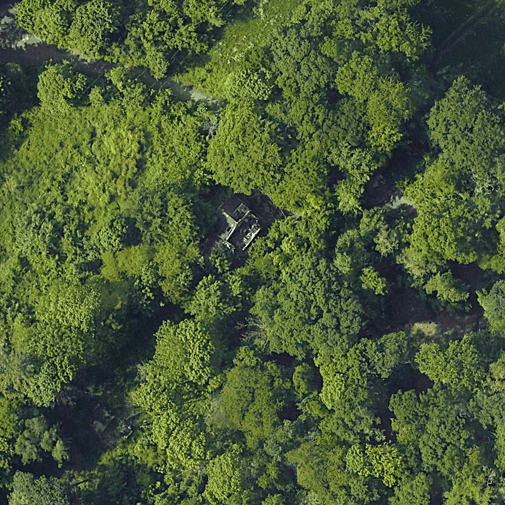
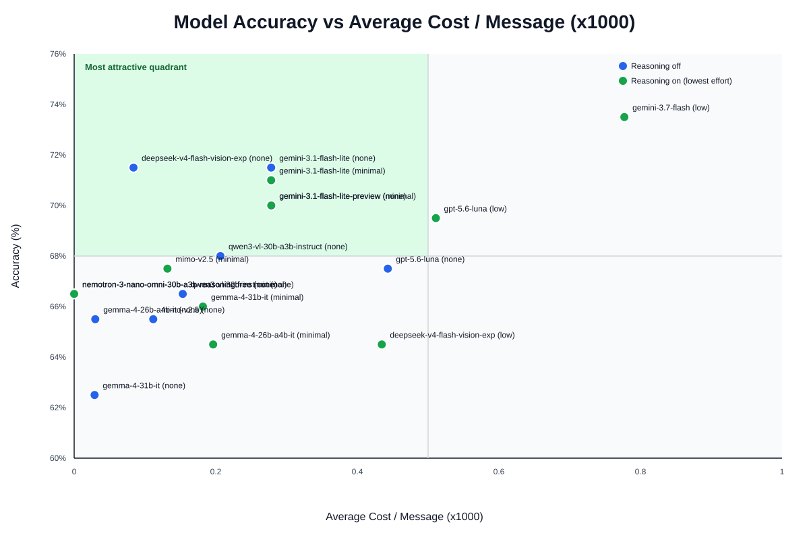

# UrbexBench

A benchmark for evaluating vision language models on urban exploration (urbex) image classification. This project tests how well different AI models can classify whether a location in satellite imagery is abandoned or not.

### Example Image


## Leaderboard

Each model is evaluated twice where possible: **reasoning disabled** (`none`) and at its **lowest supported reasoning effort** (`minimal` / `low`). Models that force reasoning are shown only at their minimum effort; models without reasoning support only once.

| Rank | Model | Effort | Accuracy |
|----- |-------|--------|----------|
| 1    | gemini-3.7-flash              | low    | 73.5% |
| 2    | gemini-3.1-flash-lite        | none   | 71.5% |
| 3    | deepseek-v4-flash-vision-exp | none   | 71.5% |
| 4    | gemini-3.1-flash-lite        | minimal| 71.0% |
| 5    | gemini-3.1-flash-lite-preview| none   | 70.0% |
| 6    | gemini-3.1-flash-lite-preview| minimal| 70.0% |
| 7    | gpt-5.6-luna                 | low    | 69.5% |
| 8    | qwen3-vl-30b-a3b-instruct    | none   | 68.0% |
| 9    | gpt-5.6-luna                 | none   | 67.5% |
| 10   | mimo-v2.5                    | minimal| 67.5% |
| 11   | qwen3-vl-32b-instruct        | none   | 66.5% |
| 12   | nemotron-3-nano-omni-30b-a3b-reasoning:free | none   | 66.5% |
| 13   | nemotron-3-nano-omni-30b-a3b-reasoning:free | minimal| 66.5% |
| 14   | gemma-4-31b-it               | minimal| 66.0% |
| 15   | gemma-4-26b-a4b-it           | none   | 65.5% |
| 16   | mimo-v2.5                    | none   | 65.5% |
| 17   | gemma-4-26b-a4b-it           | minimal| 64.5% |
| 18   | deepseek-v4-flash-vision-exp | low    | 64.5% |
| 19   | gemma-4-31b-it               | none   | 62.5% |

\* Reasoning effort per run is the lowest supported by each endpoint, derived from OpenRouter's model catalog (`none` where disabling is allowed, otherwise `minimal`/`low` as advertised). The `stealth/ox-alpha` endpoint was decommissioned and is no longer evaluated. The accuracy-vs-cost chart plots both runs per model: blue = reasoning off, green = reasoning on (lowest effort).



## Setup

### Prerequisites
- Python 3.8+
- OpenRouter API key

### Installation

1. Clone the repository:
```bash
git clone https://github.com/ruben-blok/urbexbench.git
cd urbexbench
```

2. Create a virtual environment:
```bash
python -m venv .venv
source .venv/bin/activate  # Windows: .venv\Scripts\activate
```

3. Install dependencies:
```bash
pip install -r requirements.txt
```

4. Set up environment variables:
Create a `.env` file in the project root:
```
OPENROUTER_API_KEY=your_api_key_here
```

## Usage

### Running Evaluations

Evaluate all models that haven't been tested yet:
```bash
python scripts/evaluate.py
```

The script will:
- Load all models from `models.json`
- Test each model on all images in the `img/` directory
- Save predictions and results to `results.json`

### Viewing Statistics

Generate and display accuracy statistics:
```bash
python scripts/stats.py
```

## Models Configuration

Edit `models.json` to specify which models to evaluate. The file contains a list of model IDs available through OpenRouter.

## How It Works

1. **Image Encoding**: Images are converted to base64 and sent to the API
2. **Prompt**: Models receive the image and a simple question: "Is this location abandoned?"
3. **Parsing**: The model's response is parsed for '0' (not-abandoned) or '1' (abandoned)
4. **Results**: Predictions are stored with ground truth labels for accuracy calculation

## License

See [LICENSE](LICENSE) file for details.