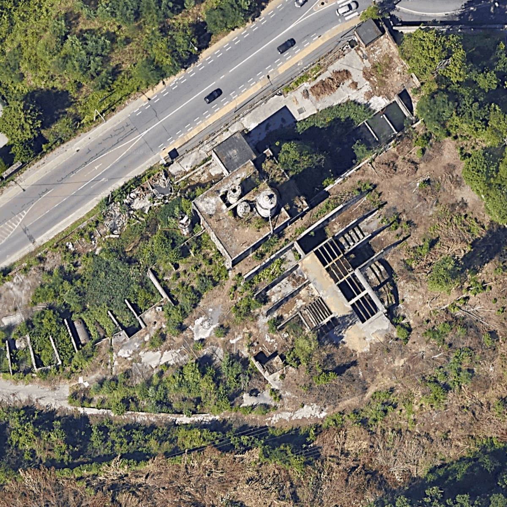

# UrbexBench

Een benchmark (toets) om te testen hoe goed verschillende AI‑modellen kunnen classificeren of een locatie in satellietbeelden verlaten is of niet. Dit kan lastig zijn voor een AI‑model, omdat het visuele aanwijzingen moet herkennen die kunnen duiden op een verlaten locatie, zoals begroeiing of kapotte daken. Er zitten ook afbeeldingen bij die niet verlaten zijn; dan moet het model dingen herkennen zoals een bouwplaats, een nieuw dak of mooi bijgewerkt gras.

### Voorbeeldfoto die beoordeeld wordt:

## Score

| Rang | Model | Parameters | Nauwkeurigheid | Totaal |
|----- |-------------------------------|------|----|-----|
| 1🥇  | Gemini 3.1 Flash Lite Preview | -    | 92 | 100 |
| 2🥈  | Qwen3 VL                      | 30   | 89 | 100 |
| 3🥉  | Qwen3.5 Plus 02-15            | 397  | 87 | 100 |
| 4    | Qwen3.5 Flash 02-23           | 35   | 86 | 100 |
| 5    | Kimi K2.5                     | 1000 | 85 | 100 |
| 5    | Qwen3 VL                      | 235  | 85 | 100 |
| 5    | Gemma 3                       | 12   | 85 | 100 |
| 6    | MiMo V2 Omni                  | -    | 84 | 100 |
| 6    | Qwen3.5                       | 9    | 84 | 100 |
| 7    | Grok 4.1 Fast                 | -    | 82 | 100 |
| 8    | Gemma 3                       | 27   | 75 | 100 |
| 9    | Ministral 2512                | 14   | 65 | 100 |
| 10   | Ministral 2512                | 8    | 63 | 100 |
| 11   | Gemma 3                       | 4    | 56 | 100 |
| 12   | Ministral 2512                | 3    | 55 | 100 |

## Werking

1. **Afbeelding coderen**: Afbeeldingen worden geconverteerd naar base64 en naar de API gestuurd
2. **Prompt**: Modellen krijgen de afbeelding en een eenvoudige vraag: "Is deze locatie verlaten?"
3. **Parsing**: De respons van het model wordt geparsed op '0' (niet verlaten) of '1' (verlaten)
4. **Resultaten**: Voorspellingen worden opgeslagen met de juiste labels voor het berekenen van nauwkeurigheid